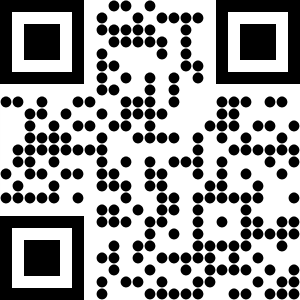

# Qr Code Generator For Laravel

<p align="center">
    <a href="https://packagist.org/packages/tuncaybahadir/quar"></a>&nbsp;
    &nbsp;
    &nbsp;
    <a href="https://packagist.org/packages/tuncaybahadir/quar"></a>&nbsp;
    
</p>

## Introduction
Quar is a new package that includes compatibility for Laravel 11 and Php 8.3 and higher versions of the packages provided by [Bacon/BaconQrCode] (https://github.com/Bacon/BaconQrCode) and [simplesoftwareio/simple-qrcode] (https://github.com/SimpleSoftwareIO/simple-qrcode).

## Requirements

- PHP 8.3+
- Laravel 11+

## Installing

Use Composer to install it:

```
composer require tuncaybahadir/quar
```

## Simple usage

```php
use tbQuar\Facades\Quar;
    
$qr = Quar::generate('Quar package create qr code');

```

And use it in your blade template this way:

```html
<div>
    {{ $qr }}
</div>
```
## Simple usage Response


***

## Example of Setting Qr Code Size

```php
use tbQuar\Facades\Quar;
    
$qr = Quar::size(61)
            ->generate('Quar package create qr code');
```
## Qr Code Size Response


***

## Example of Setting Qr Code Detection Markers

## Available Markers Type

- `square`: Default Marker Type
- `rounded`
- `circle`

```php
use tbQuar\Facades\Quar;
    
$qr = Quar::eye('rounded')
            ->generate('Quar package create qr code');
```
## Qr Code Markers Response
&nbsp;&nbsp;&nbsp;&nbsp;&nbsp;&nbsp;&nbsp;&nbsp;&nbsp;&nbsp;

***

## Example of Setting Qr Code Body Pattern Style

## Available Body Pattern

- `square`: Default Pattern
- `dot`
- `round`

```php
use tbQuar\Facades\Quar;
    
$qr = Quar::style('dot', 0.9)
            ->generate('Quar package create qr code');
```
## Qr Code Body Pattern Style Response
&nbsp;&nbsp;&nbsp;&nbsp;&nbsp;&nbsp;&nbsp;&nbsp;&nbsp;&nbsp;

***

## Example of Setting Qr Code Gradient Coloring

## Available Gradient type

- `vertical`
- `horizontal`
- `diagonal`
- `inverse_diagonal`
- `radial`

```php
use tbQuar\Facades\Quar;
    
$qr = Quar::eye('rounded')
            ->size(161)
            ->gradient(20, 192, 241 , 164, 29, 52 , 'vertical')
            ->generate('Quar package create qr code');
```
## Qr Code Gradient Coloring Response


***

## Qr Code Coloring Markers Example 1

```php
use tbQuar\Facades\Quar;
    
$qr = Quar::eye('square')
            ->eyeColor(0, 113, 6, 22, 113, 6, 22)
            ->eyeColor(1, 122, 185, 231, 122, 185, 231)
            ->eyeColor(2, 252, 184, 17)
            ->size(161)
            ->generate('Quar package create qr code');
```
## Qr Code Coloring Markers Response


***

## Qr Code Hex Code With Coloring Markers Example 2

```php
use tbQuar\Facades\Quar;
    
$qr = Quar::eye('square')
            ->eyeColorFromHex('0', '#710616', '#710616')
            ->eyeColorFromHex('1', '#7ab9e7', '#7ab9e7')
            ->eyeColorFromHex('2', '#fcb811', '#fcb811')
            ->size(161)
            ->generate('Quar package create qr code');
```
## Qr Code Coloring Markers Response 2


***

## Qr Code Coloring Example

```php
use tbQuar\Facades\Quar;
    
$qr = Quar::color(50, 168, 82)
            ->size(161)
            ->eye('circle')
            ->generate('Quar package create qr code');
```

## Qr Code Coloring Response


***

## Qr Code Hex Code With Coloring Example 2

```php
use tbQuar\Facades\Quar;
    
$qr = Quar::color('#32a852')
            ->size(161)
            ->eye('circle')
            ->generate('Quar package create qr code');
```

## Qr Code Hex Code With Coloring Response 2


***

## Qr Code Background Hex Code with Coloring Markers

```php
use tbQuar\Facades\Quar;
    
$qr = Quar::color('#710616')
            ->backgroundColor('#7ab9e7')
            ->size(261)
            ->eye('circle')
            ->generate('Quar package create qr code');
```

## Qr Code Background Hex Code with Coloring Markers Example


***

## Example Of Coloring The Background Of Qr Code 2

```php
use tbQuar\Facades\Quar;
    
$qr = Quar::color(113, 6, 22)
            ->backgroundColor(122, 185, 231)
            ->size(261)
            ->eye('circle')
            ->generate('Quar package create qr code');
```

## Sample Result Of Coloring The Background Of Qr Code 2


***

## Qr Code and Eye Coloring Example
 
```php
use tbQuar\Facades\Quar;
    
$qr = Quar::color(235, 12, 83)
            ->size(161)
            ->eye('rounded')
            ->eyeColor(0, 113, 6, 22, 113, 6, 22)
            ->eyeColor(1, 122, 185, 231, 122, 185, 231)
            ->eyeColor(2, 252, 184, 17)
            ->generate('Quar package create qr code');
```

## Qr Code and Marker Coloring Response 


***

## Example of Saving Qr Code as a Png File

```php
use tbQuar\Facades\Quar;
    
        $qrCodeFileName = md5(random_int(0, 9999999).date('H:i:s d.m.Y')).'_qr_code';
        $qrCodeData = 'Quar package create qr code';
        $qrCodeDirectory = storage_path('app/public/qr-code-images/');

        Quar::format('png')
            ->color(155, 155, 200)
            ->size(200)
            ->eye('rounded')
            ->generate($qrCodeData, $qrCodeDirectory.$qrCodeFileName.'.png');

        $qrCode = url('storage/qr-code-images/'.$qrCodeFileName.'.png');

```
And use it in your blade template this way:

```html
<div>
    
</div>
```
## Saving Qr Code as a File Response
&nbsp;&nbsp;&nbsp;&nbsp;&nbsp;

***

## Example of Compressing and Saving a Qr Code as a Png File
```php
use tbQuar\Facades\Quar;
    
        $qrCodeFileName = md5(random_int(0, 9999999).date('H:i:s d.m.Y')).'_qr_code';
        $qrCodeData = 'Quar package create qr code';
        $qrCodeDirectory = storage_path('app/public/qr-code-images/');

        Quar::format('png')
            ->setPngCompression(50)
            ->color(155, 155, 200)
            ->size(200)
            ->eye('rounded')
            ->generate($qrCodeData, $qrCodeDirectory.$qrCodeFileName.'.png');

        $qrCode = url('storage/qr-code-images/'.$qrCodeFileName.'.png');

```

***

## Example of Adding Logo on QR Code

`Attention !!! : Due to a bug in the BaconQrCode package, you must set the margin value to 1 or higher during logo insertion. Otherwise the qr code is generated incorrectly.`

Example 1:
```php
use tbQuar\Facades\Quar;
    
        $qr = Quar::format('png')
            ->margin(1)
            ->merge(public_path('php.png'), .2, true)
            ->size(400)
            ->generate('Quar package create qr code');
            
            return view('test', [
                'qrCode' => base64_encode($qr),
            ]);

```
Example 2:
```php
use tbQuar\Facades\Quar;
    
        $qr = Quar::format('png')
            ->margin(1)
            ->eye('rounded')
            ->merge(public_path('php.png'), .3, true)
            ->size(200)
            ->gradient(100, 20, 5 , 7, 9, 12 , 'VERTICAL')
            ->generate('Quar package create qr code');
            
            return view('test', [
                'qrCode' => base64_encode($qr),
            ]);

```

And use it in your blade template this way:

```html
<div>
    
</div>
```
## Adding Logo on Qr Code Sample Code Result 1:


## Adding Logo on Qr Code Sample Code Result 2:


## Authors

- [Tuncay Bahadır](https://github.com/tuncaybahadir)

***

## Contributing

Pull requests and issues are more than welcome.

***

<a href="https://www.buymeacoffee.com/tuncaybahadir" target="_blank"></a>